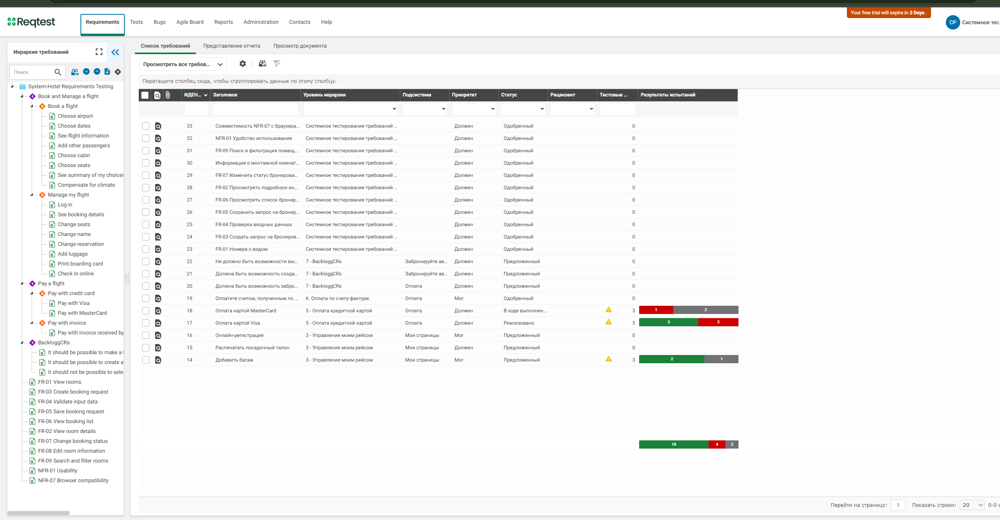
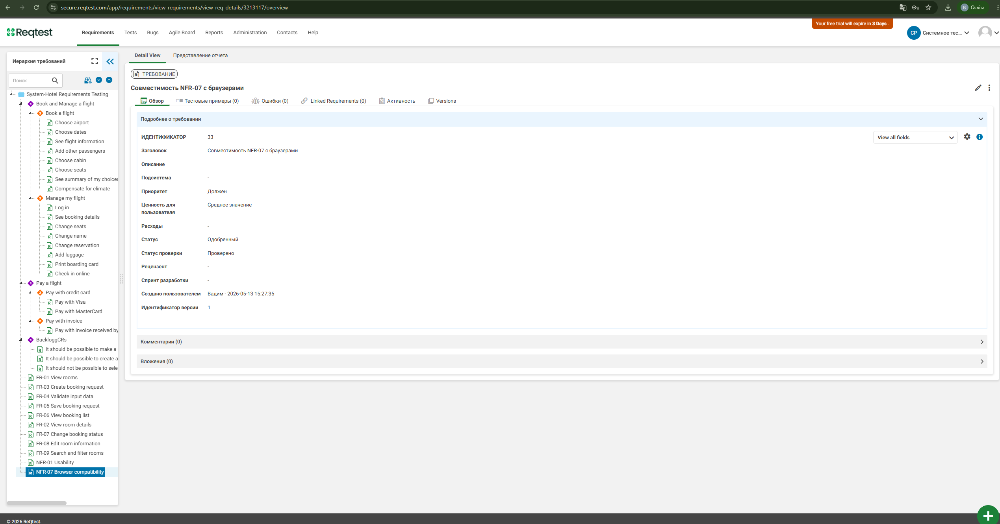
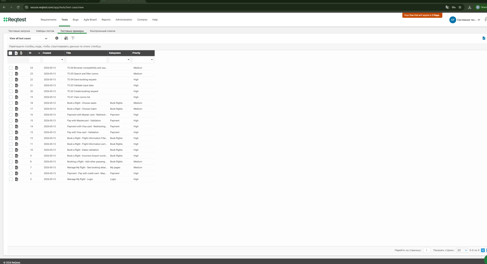
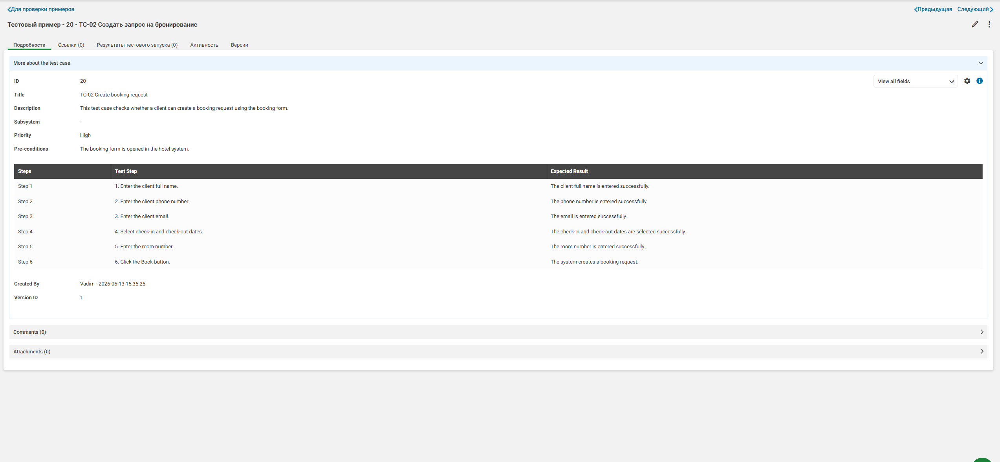
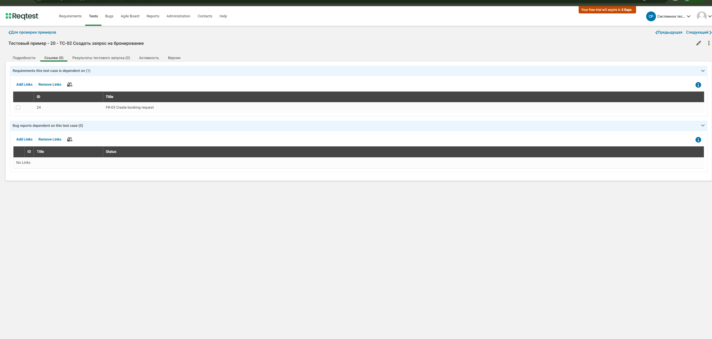
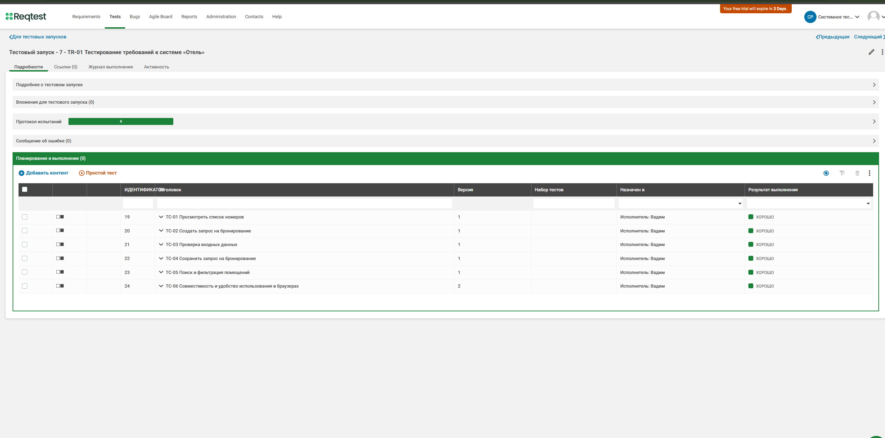
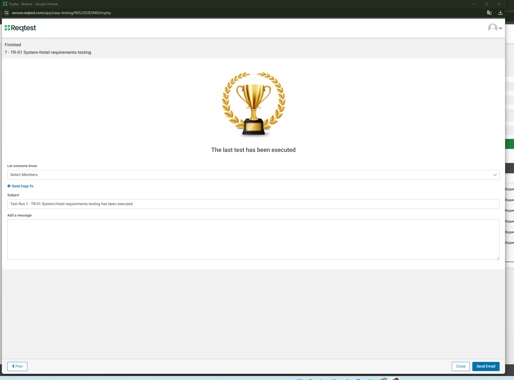

# Тестування програмної системи «Готель» у Reqtest

## Тема роботи

Тестування програмної системи в Reqtest з урахуванням завдань, сформульованих у проєкті, навчальних матеріалів та підходів до управління вимогами і тестуванням програмного забезпечення.

## Мета роботи

Здійснити тестування програмної системи **«Готель»** в інструменті **Reqtest**, підготувати вимоги, тест-кейси, виконати тестовий запуск і зафіксувати результати тестування.

## Програмна система

**Програмна система «Готель»** — навчальний вебзастосунок для перегляду номерів, пошуку і фільтрації номерів, створення заявки на бронювання, перевірки введених даних та збереження результатів бронювання.

Основні функції системи:

- перегляд списку номерів;
- перегляд інформації про номер;
- створення заявки на бронювання;
- перевірка вхідних даних;
- збереження заявки;
- пошук і фільтрація номерів;
- перевірка сумісності з браузером.

---

## Використаний інструмент

Для виконання роботи використано **Reqtest** — інструмент для управління вимогами, тест-кейсами, тестовими запусками та результатами тестування.

У межах роботи в Reqtest було виконано:

- створення вимог до системи;
- створення тест-кейсів;
- деталізацію тест-кейса;
- зв’язування вимоги з тест-кейсом;
- виконання тестового запуску;
- фіксацію результатів тестування.

---

## Результати роботи

У межах виконання завдання підготовлено:

- вимоги до програмної системи «Готель» у Reqtest;
- тест-кейси для перевірки основних функцій системи;
- детальний тест-кейс для створення заявки на бронювання;
- зв’язок між вимогою `FR-03 Create booking request` і тест-кейсом `TC-02 Create booking request`;
- тестовий запуск `TR-01 System-Hotel requirements testing`;
- скріни-пруфи виконання тестування;
- підсумковий звіт про тестування.

---

## Файли репозиторію

| Файл / папка | Призначення |
|---|---|
| `docs/reqtest-testing-report.md` | Повний текст звіту про тестування системи в Reqtest |
| `test-cases/hotel-test-cases.md` | Опис тест-кейсів для програмної системи «Готель» |
| `screenshots/` | Скріни-пруфи виконання тестування в Reqtest |
| `README.md` | Короткий опис роботи та структура репозиторію |

---

## Перегляд матеріалів

### Повний звіт про тестування

[Відкрити docs/reqtest-testing-report.md](docs/reqtest-testing-report.md)

### Тест-кейси системи «Готель»

[Відкрити test-cases/hotel-test-cases.md](test-cases/hotel-test-cases.md)

---

## Вимоги до системи в Reqtest

У Reqtest було створено набір вимог для проєкту **System-Hotel Requirements Testing**.

Основні вимоги:

| ID | Назва вимоги | Призначення |
|---|---|---|
| FR-01 | View rooms | Перегляд номерів готелю |
| FR-02 | View room details | Перегляд детальної інформації про номер |
| FR-03 | Create booking request | Створення заявки на бронювання |
| FR-04 | Validate input data | Перевірка введених даних |
| FR-05 | Save booking request | Збереження заявки на бронювання |
| FR-06 | View booking list | Перегляд списку бронювань |
| FR-09 | Search and filter rooms | Пошук і фільтрація номерів |
| NFR-01 | Usability | Зручність використання системи |
| NFR-07 | Browser compatibility | Сумісність системи з браузерами |

### Пруф створення вимог



---

## Деталізація вимоги

Для перевірки структури вимог було відкрито детальну картку вимоги **NFR-07 Browser compatibility**.

На скріні видно ідентифікатор, назву, пріоритет, статус, статус перевірки, автора створення та версію вимоги.



---

## Тест-кейси

Для перевірки системи було створено тест-кейси:

| ID | Назва тест-кейса | Пріоритет | Призначення |
|---|---|---|---|
| TC-01 | View rooms list | High | Перевірка відображення списку номерів |
| TC-02 | Create booking request | High | Перевірка створення заявки на бронювання |
| TC-03 | Validate input data | High | Перевірка валідації введених даних |
| TC-04 | Save booking request | High | Перевірка збереження заявки |
| TC-05 | Search and filter rooms | Medium | Перевірка пошуку і фільтрації номерів |
| TC-06 | Browser compatibility and usability | Medium | Перевірка сумісності з браузером і зручності використання |

### Пруф списку тест-кейсів



---

## Деталізація тест-кейса

Для детальної перевірки було відкрито тест-кейс **TC-02 Create booking request**.

Тест-кейс перевіряє створення заявки на бронювання номера за допомогою форми бронювання.

Основні кроки тестування:

| Крок | Дія | Очікуваний результат |
|---|---|---|
| 1 | Ввести повне ім’я клієнта | Ім’я клієнта введено успішно |
| 2 | Ввести номер телефону | Номер телефону введено успішно |
| 3 | Ввести email | Email введено успішно |
| 4 | Обрати дати заїзду та виїзду | Дати вибрано успішно |
| 5 | Ввести номер кімнати | Номер кімнати введено успішно |
| 6 | Натиснути кнопку бронювання | Система створює заявку на бронювання |



---

## Зв’язок вимоги з тест-кейсом

У Reqtest було створено зв’язок між вимогою **FR-03 Create booking request** і тест-кейсом **TC-02 Create booking request**.

Це підтверджує трасування між вимогою та тестуванням.



---

## Результати тестового запуску

Було виконано тестовий запуск:

**TR-01 System-Hotel requirements testing**

У тестовий запуск були включені тест-кейси `TC-01`–`TC-06`.

Усі тест-кейси отримали позитивний результат виконання.



---

## Завершення тестування

Після виконання останнього тест-кейса Reqtest показав повідомлення про завершення тестового запуску.



---

## Підсумкова таблиця результатів

| Тест-кейс | Що перевіряє | Результат |
|---|---|---|
| TC-01 | Перегляд списку номерів | Пройдено |
| TC-02 | Створення заявки на бронювання | Пройдено |
| TC-03 | Перевірка введених даних | Пройдено |
| TC-04 | Збереження заявки | Пройдено |
| TC-05 | Пошук і фільтрація номерів | Пройдено |
| TC-06 | Сумісність із браузером і зручність використання | Пройдено |

---

## Структура репозиторію

```text
hotel-reqtest-testing/
│
├── README.md
│
├── docs/
│   └── reqtest-testing-report.md
│
├── test-cases/
│   └── hotel-test-cases.md
│
└── screenshots/
    ├── 01_reqtest_project_requirements.png
    ├── 02_reqtest_requirement_details.png
    ├── 03_reqtest_test_cases_list.png
    ├── 04_reqtest_test_case_details.png
    ├── 05_reqtest_requirement_test_link.png
    ├── 06_reqtest_test_run_results.png
    └── 07_reqtest_test_run_finished.png
```

---

## Висновок

У результаті виконання роботи було здійснено тестування програмної системи **«Готель»** в інструменті **Reqtest**.

Було створено вимоги, підготовлено тест-кейси, деталізовано тест-кейс створення заявки на бронювання, встановлено зв’язок між вимогою та тест-кейсом, а також виконано тестовий запуск.

Результати тестування показали, що основні функції програмної системи працюють коректно. Усі тест-кейси тестового запуску отримали позитивний результат.

---

## Джерело

Reqtest — Test Management:  
https://reqtest.com/en/features/test-management/
